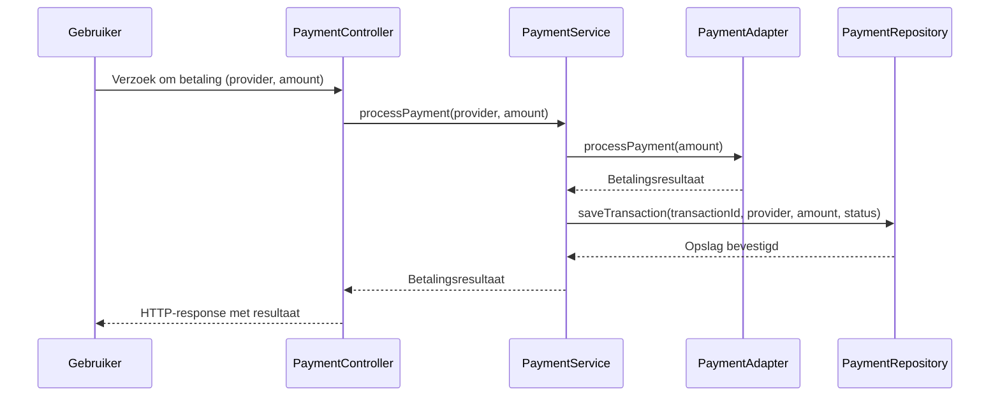
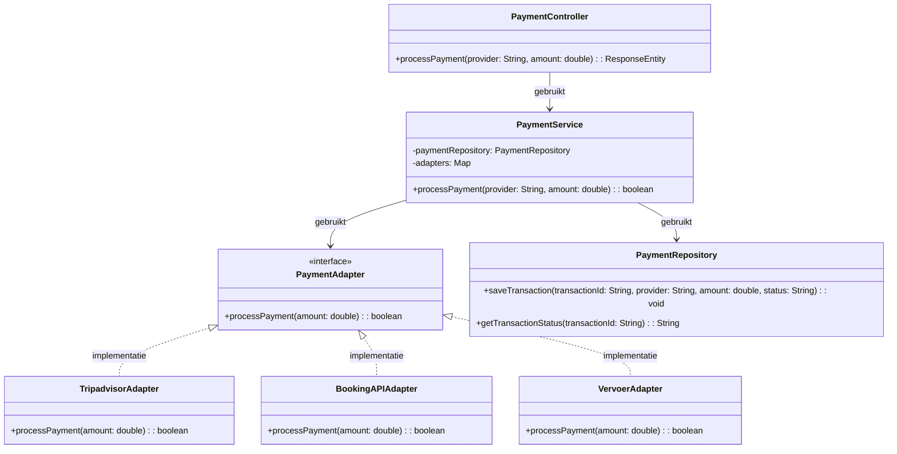

# Hoe kunnen we verschillende betalingssystemen integreren voor de verschillende bouwstenen

## Componenten 
- Bouwsteen Controller
- Bouwsteen Service
- Bouwsteen Repository
- TripadvisorAdapter
- BookingAPIAdapter
- VervoerAdapter

| **Component**           | **Verantwoordelijkheid** | **Toepassing van Design Principles** |
|-------------------------|------------------------|--------------------------------|
| **Bouwsteen Controller** | Ontvangt HTTP-verzoeken, valideert invoer en stuurt de aanvraag door naar de service laag. | **SRP**: Alleen verantwoordelijk voor request handling. |
| **Bouwsteen Service**    | Bevat de businesslogica en roept de juiste betalingsadapter aan. | **Encapsulate What Varies**: De logica voor verschillende betalingssystemen is hier losgekoppeld. |
| **Bouwsteen Repository** | Interactie met de database (ophalen en opslaan van gegevens zoals transacties). | **Separation of Concerns**: Data-opslag is gescheiden van businesslogica. |
| **TripadvisorAdapter**   | Verzorgt communicatie met het betalings- en boekingssysteem van Tripadvisor. | **Encapsulate What Varies**: Specifiek voor Tripadvisor. |
| **BookingAPIAdapter**    | Verzorgt communicatie met de betalings- en boekingssysteem van Booking.com. | **Encapsulate What Varies**: Specifiek voor Booking.com. |
| **VervoerAdapter**       | Verzorgt communicatie met een vervoersbetalingssysteem (bijv. trein, taxi of vliegtuigreserveringen). | **Encapsulate What Varies**: Specifiek voor vervoerssystemen. |

| **Interface**          | **Methoden** |
|------------------------|-------------|
| **PaymentAdapter**     | `boolean processPayment(double amount);` |
| **PaymentService**     | `boolean processPayment(String provider, double amount);` |
| **PaymentRepository**  | `void saveTransaction(String transactionId, String provider, double amount, String status);` `String getTransactionStatus(String transactionId);` |
| **PaymentController**  | `ResponseEntity<String> makePayment(String provider, double amount);` |

