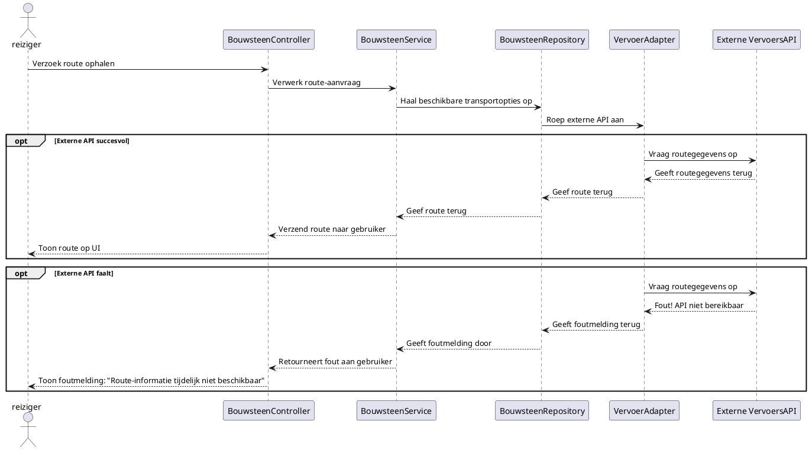

# Hoe kunnen we verschillende externe vervoersservices (zoals Google Maps of een veerdienst API) integreren zonder afhankelijk te worden van hun specifieke implementaties?

## Voorbereiding:
- BouwsteenController
- BouwsteenService
- BouwsteenRepository
- VervoerAdapter

## Verantwoordelijkheden

| Component           | Verantwoordelijkheid                                                                      | Toepassing van Design Principles |
| ------------------- | ----------------------------------------------------------------------------------------- | -------------------------------- |
| BouwsteenController | Ontvangt HTTP-verzoeken, valideert invoer en stuurt de aanvraag door naar de service laag | **Separation of Concerns**       |
| BouwsteenService    | Verwerking van businesslogica en interactie met BouwsteenRepository                       | **SRP**                          |
| BouwsteenRepository | Interactie met de database en VervoersAdapter                                             | **Encapsulate What Varies**      |
| VervoerAdapter      | Interactie met vervoers API's zoals flightsAPI                                            | **Cohesion**                     |

## Interfaces
- VervoersAdapter
```java
Route getRoute(Location start, Location end, TransportMode mode); 
List<TransportOption> getAvailableTransportOptions(Location start, Location end);
```

## Volgorde
Controllers -> Service -> Repository -> Adapter -> API

## Opdelen
- Controller blijft controller
- Service blijft service
- Repository blijft repository
- Adapter blijft Adapter