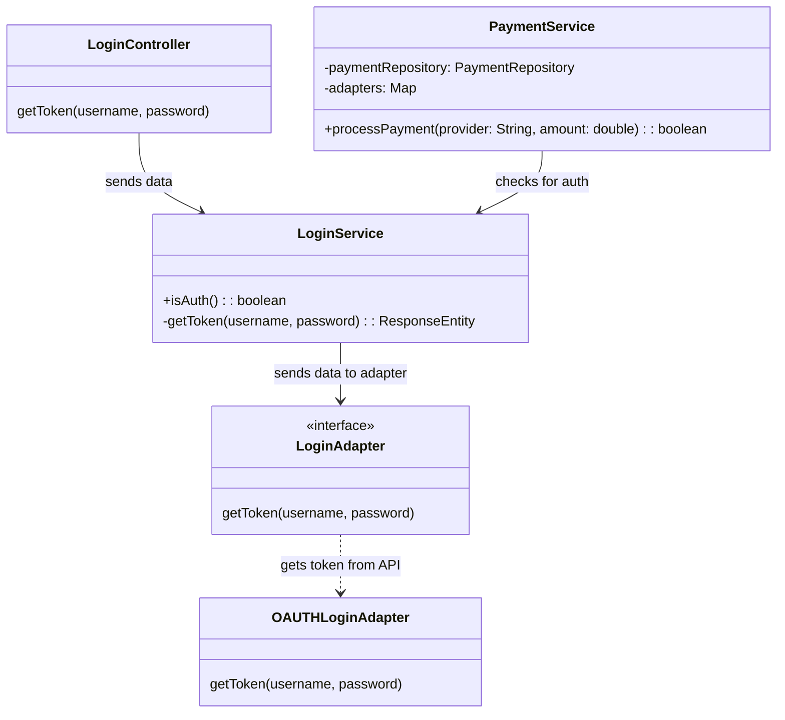

```mermaid
classDiagram

class LoginController{
    getToken(username, password)
}

class LoginService{
    +isAuth() : boolean
    -getToken(username, password) : ResponseEntity<String>
}

class LoginAdapter{
    <<interface>>
    getToken(username, password)
}

class OAUTHLoginAdapter{
    getToken(username, password)
}


class PaymentService {
    +processPayment(provider: String, amount: double): boolean
    -paymentRepository: PaymentRepository
    -adapters: Map<String, PaymentAdapter>
}

LoginController --> LoginService : sends data
LoginService --> LoginAdapter : sends data to adapter
LoginAdapter ..> OAUTHLoginAdapter : gets token from API
PaymentService --> LoginService : checks for auth

```
