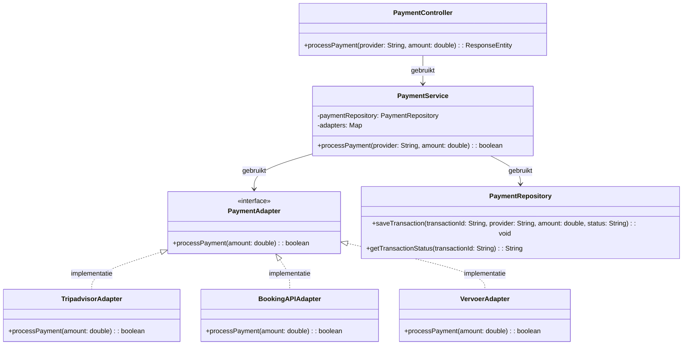

```mermaid
classDiagram
    class PaymentController {
        +processPayment(provider: String, amount: double): ResponseEntity<String>
    }

    class PaymentService {
        +processPayment(provider: String, amount: double): boolean
        -paymentRepository: PaymentRepository
        -adapters: Map<String, PaymentAdapter>
    }

    class PaymentAdapter {
        <<interface>>
        +processPayment(amount: double): boolean
    }

    class TripadvisorAdapter {
        +processPayment(amount: double): boolean
    }

    class BookingAPIAdapter {
        +processPayment(amount: double): boolean
    }

    class VervoerAdapter {
        +processPayment(amount: double): boolean
    }

    class PaymentRepository {
        +saveTransaction(transactionId: String, provider: String, amount: double, status: String): void
        +getTransactionStatus(transactionId: String): String
    }

    %% Relaties tussen de klassen
    PaymentController --> PaymentService : gebruikt
    PaymentService --> PaymentAdapter : gebruikt
    PaymentService --> PaymentRepository : gebruikt
    PaymentAdapter <|.. TripadvisorAdapter : implementatie
    PaymentAdapter <|.. BookingAPIAdapter : implementatie
    PaymentAdapter <|.. VervoerAdapter : implementatie
```