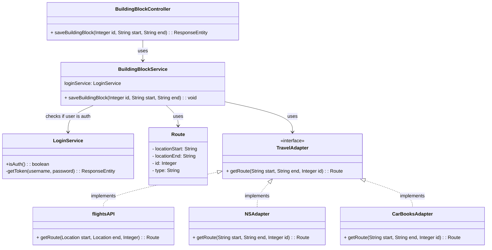

```mermaid
classDiagram

class BuildingBlockController {
    + saveBuildingBlock(Integer id, String start, String end): ResponseEntity<Integer, String>
}

class BuildingBlockService {
    loginService: LoginService
    + saveBuildingBlock(Integer id, String start, String end): void
}

class LoginService{
    +isAuth() : boolean
    -getToken(username, password) : ResponseEntity<String>
}

class Route {
    - locationStart: String
    - locationEnd: String
    - id: Integer
    - type: String
}

class TravelAdapter {
    <<interface>>
    + getRoute(String start, String end, Integer id): Route
}

class flightsAPI {
    + getRoute(Location start, Location end, Integer): Route
}

class NSAdapter {
    + getRoute(String start, String end, Integer id): Route
}

class CarBooksAdapter {
    + getRoute(String start, String end, Integer id): Route
}

BuildingBlockController --> BuildingBlockService : uses
BuildingBlockService --> LoginService : checks if user is auth
BuildingBlockService --> TravelAdapter : uses
BuildingBlockService --> Route : uses
TravelAdapter <|.. flightsAPI : implements
TravelAdapter <|.. NSAdapter : implements
TravelAdapter <|.. CarBooksAdapter : implements
```