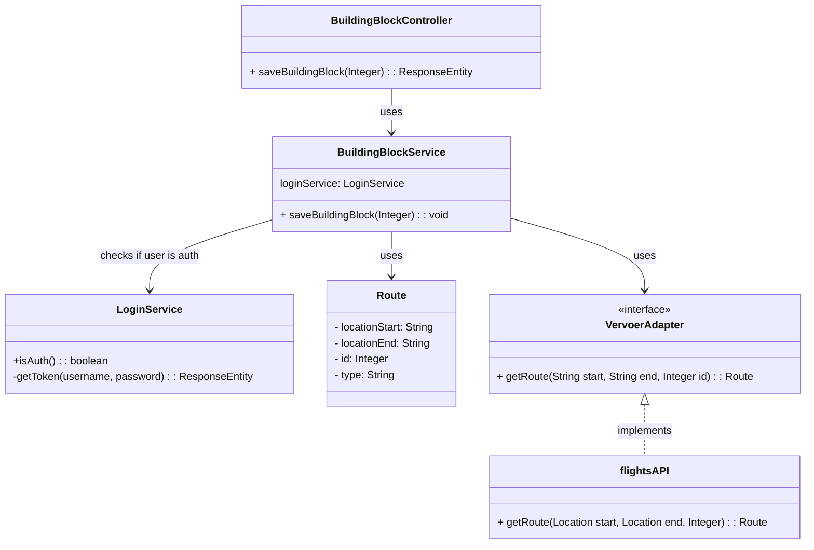

```mermaid
classDiagram

class BuildingBlockController {
    + saveBuildingBlock(Integer): ResponseEntity<Integer>
}

class BuildingBlockService {
    loginService: LoginService
    + saveBuildingBlock(Integer): void
}

class LoginService{
    +isAuth() : boolean
    -getToken(username, password) : ResponseEntity<String>
}

class Route {
    - locationStart: String
    - locationEnd: String
    - id: Integer
    - type: String
}

class VervoerAdapter {
    <<interface>>
    + getRoute(String start, String end, Integer id): Route
}

class flightsAPI{
    + getRoute(Location start, Location end, Integer): Route
}

BuildingBlockController --> BuildingBlockService : uses
BuildingBlockService --> LoginService : checks if user is auth
BuildingBlockService --> VervoerAdapter : uses
BuildingBlockService --> Route : uses
VervoerAdapter <|.. flightsAPI : implements
```