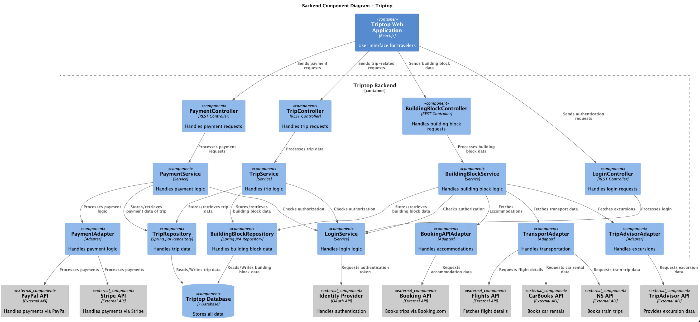
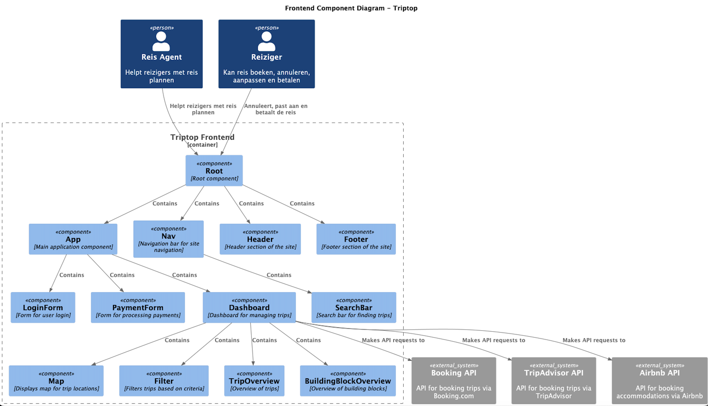
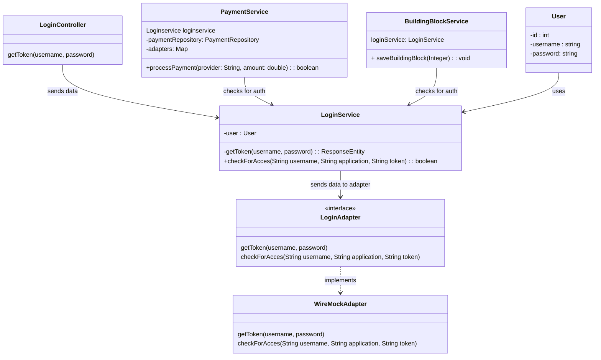
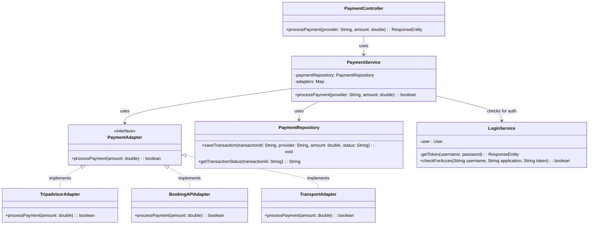

# Software Guidebook Triptop

## 1. Introduction
Dit software guidebook geeft een overzicht van de Triptop-applicatie. Het bevat een samenvatting van het volgende:
1. De vereisten, beperkingen en principes.
1. De software-architectuur, met inbegrip van de technologiekeuzes op hoog niveau en de structuur van de software.
1. De ontwerp- en codebeslissingen die zijn genomen om de software te realiseren.
1. De architectuur van de infrastructuur en hoe de software kan worden geinstalleerd.

## 2. Context

> [!IMPORTANT]
> Werk zelf dit hoofdstuk uit met context diagrammen en een beschrijving van de context van de software.


Toelichting op de context van de software inclusief System Context Diagram:
* Functionaliteit
* Gebruikers
* Externe systemen

## 3. Functional Overview

Om de belangrijkste features toe te lichten zijn er user stories en twee domain stories gemaakt en een overzicht van het domein in de vorm van een domeinmodel. Op deze plek staat typisch een user story map maar die ontbreekt in dit voorbeeld.

### 3.1 User Stories

#### 3.1.1 User Story 1: Reis plannen

Als gebruiker wil ik een zelfstandig op basis van diverse variabelen (bouwstenen) een reis kunnen plannen op basis van mijn reisvoorkeuren (wel/niet duurzaam reizen, budget/prijsklasse, 's nachts reizen of overdag etc.) zodat ik op vakantie kan gaan zonder dat hiervoor een reisbureau benodigd is.

#### 3.1.2 User Story 2: Reis boeken

Als gebruiker wil ik een geplande reis als geheel of per variabele (bouwsteen) boeken en betalen zodat ik op vakantie kan gaan zonder dat hiervoor een reisbureau benodigd is.

#### 3.1.3 User Story 3: Reis cancelen

Als gebruiker wil ik een geboekte reis, of delen daarvan, kunnen annuleren zodat ik mijn geld terug kan krijgen zonder inmenging van een intermediair zoals een reisbureau.

#### 3.1.4 User Story 4: Reisstatus bewaren

Als gebruiker wil ik mijn reisstatus kunnen bewaren zonder dat ik een extra account hoef aan te maken zodat ik mijn reis kan volgen zonder dat ik daarvoor extra handelingen moet verrichten.

#### 3.1.5 User Story 5: Bouwstenen flexibel uitbreiden

Als gebruiker wil ik de bouwstenen van mijn reis flexibel kunnen uitbreiden met een zelf te managen stap (bijv. met providers die niet standaard worden aangeboden zoals een andere reisorganisatie, hotelketen etc.) zodat ik mijn reis helemaal kan aanpassen aan mijn wensen.

### 3.2 Domain Story Reis Boeken (AS IS)


### 3.3 Domain Story Reis Boeken (TO BE)


### 3.4 Domain Model


## 4. Quality Attributes

Voordat deze casusomschrijving tot stand kwam, heeft de opdrachtgever de volgende ISO 25010 kwaliteitsattributen benoemd als belangrijk:
* Compatibility -> Interoperability (Degree to which a system, product or component can exchange information with other products and mutually use the information that has been exchanged)
* Reliability -> Fault Tolerance (Degree to which a system or component operates as intended despite the presence of hardware or software faults)
* Maintainability -> Modularity (Degree to which a system or computer program is composed of discrete components such that a change to one component has minimal impact on other components)
* Maintainability -> Modifiability (Degree to which a product or system can be effectively and efficiently modified without introducing defects or degrading existing product quality)
* Security -> Integrity (Degree to which a system, product or component ensures that the state of its system and data are protected from unauthorized modification or deletion either by malicious action or computer error)
* Security -> Confidentiality (Degree to which a system, product or component ensures that data are accessible only to those authorized to have access)

## 5. Constraints
Lars vindt dit stom, dus wij hebben als tip gekregen dit niet te doen :). (Lars zei niet doen for the record)

## 6. Principles

> [!IMPORTANT]
> Beschrijf zelf de belangrijkste architecturele en design principes die zijn toegepast in de software.

## 7. Software Architecture

###     7.1. Containers

> [!IMPORTANT]
> Voeg toe: Container Diagram plus een Dynamic Diagram van een aantal scenario's inclusief begeleidende tekst.


###     7.2. Components

> [!IMPORTANT]
> Voeg toe: Component Diagram plus een Dynamic Diagram van een aantal scenario's inclusief begeleidende tekst.

#### Backend



#### Frontend



###     7.3. Design & Code

> [!IMPORTANT]
> Voeg toe: Per ontwerpvraag een Class Diagram plus een Sequence Diagram van een aantal scenario's inclusief begeleidende tekst.

#### Hoe kunnen we verschillende identity providers met verschillende interfaces integreren voor het gehele systeem? (Chris)




#### Hoe kunnen we verschillende betalingssystemen integreren voor de verschillende bouwstenen? (Sacha)



#### Hoe kunnen we verschillende externe vervoersservices (zoals Google Maps of een veerdienst API) integreren zonder afhankelijk te worden van hun specifieke implementaties? (Youp)

```mermaid
classDiagram

class BuildingBlockController {
    + getTravelData(@RequestParam String locationStart
            , @RequestParam String locationEnd, @RequestParam String transportType): String
}

class BuildingBlockService {
    loginService: LoginService
    + getTravelData(String locationStart, String locationEnd, String transportType, User user): String
}

class LoginService{
    -getToken(username, password) : ResponseEntity<String>
    +checkForAcces(String username, String application, String token) : boolean
}

class TravelAdapter {
    <<interface>>
    + getRoute(String locationStart, String locationEnd): String
}

class NSAdapter {
    + getRoute(String locationStart, String locationEnd): String
}

class CarBooksAdapter {
    + getRoute(String locationStart, String locationEnd): String
}

BuildingBlockController --> BuildingBlockService : uses
BuildingBlockService --> LoginService : checks if user is auth
BuildingBlockService --> TravelAdapter : uses
BuildingBlockService --> Route : uses
TravelAdapter <|.. flightsAPI : implements
TravelAdapter <|.. NSAdapter : implements
TravelAdapter <|.. CarBooksAdapter : implements
```


## 8. Architectural Decision Records

> [!IMPORTANT]
> Voeg toe: 3 tot 5 ADR's die beslissingen beschrijven die zijn genomen tijdens het ontwerpen en bouwen van de software.

### ADR VervoersAdapter Frontend of backend
02-04-2025

Status: accepted

#### Context
Voor TripTop willen gebruikers bij hun tripvoorstellen ook verschillende vervoersopties kunnen bekijken. Nu moeten we bepalen waar de vervoersadapters het beste geplaatst kunnen worden: in de backend of in de frontend.

#### Considered Options
##### Backend
###### Controller
```java
@RestController  
public class BuildingBlockController {  
  
    @Autowired  
    private BuildingBlockService buildingBlockService;  
  
    @GetMapping("/traveldata")  
    public String getTravelData(@RequestParam String locationStart  
            , @RequestParam String locationEnd, @RequestParam String transportType) throws UnirestException {  
        User user = new User("edevries", "3g2Rw9sT1x");  
  
        return buildingBlockService.getTravelData(locationStart, locationEnd, transportType, user);  
    }  
}
```

###### Service
```java
@Service  
public class BuildingBlockService {  
  
    @Autowired  
    private LoginService loginService;  
  
    @Autowired  
    @Qualifier("NSAdapter")  
    private TravelAdapter nsAdapter;  
  
    @Autowired  
    @Qualifier("drivingDirectionAdapter") // first letter cannot be capital  
    private TravelAdapter drivingDirectionAdapter;  
  
    public String getTravelData(String locationStart, String locationEnd, String transportType, User user) throws UnirestException {  
        String result = "";  
        String token = loginService.getToken(user.username(), user.password());  
   
        if(loginService.checkForAcces(user.username(), token)) {  
            switch (transportType) {  
                case "TRAIN":  
                    result = nsAdapter.getRoute(locationStart, locationEnd);  
                    break;  
                case "CAR":  
	                result = drivingDirectionAdapter.getRoute(locationStart, locationEnd);  
                    break;  
                default:  
            }  
        } else {  
            return "no access";  
        }  
        return result;  
    }  
}
```

###### Adapter Interface
```java
@Component  
public interface TravelAdapter {  
    String getRoute(String locationStart, String locationEnd) throws UnirestException;  
}
```

###### NSAdapter
```java
@Component  
public class NSAdapter implements TravelAdapter{  
    @Value("${nsApiKey}")  
    private String apiKey;  
  
    @Override  
    public String getRoute(String locationStart, String locationEnd) throws UnirestException {  
        HttpResponse<JsonNode> response = Unirest.get("https://gateway.apiportal.ns.nl/reisinformatie-api/api/v3/trips?" + "fromStation=" + locationStart + "&toStation=" + locationEnd)  
                .header("Content-Type", "application/json")  
                .header("Cache-Control", "no-cache")  
                .header("Ocp-Apim-Subscription-Key", apiKey)  
                .asJson();  
  
        JSONObject jsonObject = response.getBody().getObject();  
        JSONArray trips = jsonObject.getJSONArray("trips");  
  
        StringBuilder result = new StringBuilder();  
  
        if(trips.length() > 0) {  
            for (int i = 0; i < trips.length(); i++) {  
                JSONObject trip = trips.getJSONObject(i).getJSONArray("legs").getJSONObject(0);  
  
                String transportType = trip.getJSONObject("product").getString("longCategoryName");  
                String departureTime = trip.getJSONObject("origin").getString("plannedDateTime");  
                String arrivalTime = trip.getJSONObject("destination").getString("plannedDateTime");  
                int priceInCents = trips.getJSONObject(i).getJSONArray("fares").getJSONObject(0).getInt("priceInCents");  
                double price = priceInCents / 100.0;  
  
                result.append(String.format("Option %d: Transport Type: %s, Departure Time: %s, Arrival Time: %s, Price: €%.2f\n", i + 1, transportType, departureTime, arrivalTime, price));  
            }  
        } else {  
            result.append("No routes found.");  
        }  
        return result.toString();  
    }  
}
```

###### DrivingDirectionAdapter
```java
@Component  
public class DrivingDirectionAdapter implements TravelAdapter{  
    @Value("${drivingDirectionApiKey}")  
    private String apiKey;  
  
    @Override  
    public String getRoute(String locationStart, String locationEnd) throws UnirestException {  
        HttpResponse<JsonNode> response = Unirest.get("https://driving-directions1.p.rapidapi.com/get-directions?" + "origin=" + locationStart + "&destination=" + locationEnd + "&distance_units=km&avoid_routes=tolls%2Cferries&country=nl&language=en")  
                .header("Content-Type", "application/json")  
                .header("x-rapidapi-key", apiKey)  
                .header("x-rapidapi-host", "driving-directions1.p.rapidapi.com")  
                .asJson();  
  
        StringBuilder result = new StringBuilder();  
  
        JSONObject jsonObject = response.getBody().getObject();  
        JSONObject data = jsonObject.getJSONObject("data");  
        JSONObject origin = data.getJSONObject("origin");  
        JSONObject destination = data.getJSONObject("destination");  
        JSONArray bestRoutes = data.getJSONArray("best_routes");  
  
        if (bestRoutes.length() > 0) {  
            JSONObject bestRoute = bestRoutes.getJSONObject(0);  
            String distanceLabel = bestRoute.getString("distance_label");  
            String durationLabel = bestRoute.getString("duration_label");  
  
            result.append(String.format("Origin: %s, Destination: %s, Distance: %s, Duration: %s",  
                    origin.getString("name"), destination.getString("name"), distanceLabel, durationLabel));  
        } else {  
            result.append("No routes found.");  
        }  
  
        return result.toString();  
    }  
}
```

##### Frontend
###### TravelService
```javascript
export class TravelService {
    async getRoutes(origin, destination) {
      throw new Error('Method not implemented');
    }
  }
```

###### NSAdapter
```javascript
export class NSAdapter extends TravelService  {
    constructor() {
      this.apiKey = import.meta.env.VITE_NS_API_KEY;
    }
    
    async getRoutes(origin, destination) {
      const response = await fetch(
        `https://gateway.apiportal.ns.nl/reisinformatie-api/api/v3/trips?fromStation=${origin}&toStation=${destination}`,
        {
          headers: {
            'Content-Type': 'application/json',
            'Cache-Control': 'no-cache',
            'Ocp-Apim-Subscription-Key': this.apiKey,
            'Origin': 'http://localhost:5173'
          }
        }
      );
      const jsonData = await response.json();
      const trips = jsonData.trips;
      if (trips.length === 0) {
        return [];
      }
      return trips.map(trip => {
        const leg = trip.legs[0];
        return {
          origin: leg.origin.name,
          destination: leg.destination.name,
          departureTime: leg.origin.plannedDateTime,
          arrivalTime: leg.destination.plannedDateTime
        };
      });
    }
  }
```

###### DrivingDirectionAdapter
```javascript
export class DrivingAdapter extends TravelService {
    constructor() {
      this.apiKey = import.meta.env.VITE_DRIVING_API_KEY;
    }
    async getRoutes(origin, destination) {
      const response = await fetch(
        `https://driving-directions1.p.rapidapi.com/get-directions?origin=${origin}&destination=${destination}&distance_units=km&avoid_routes=tolls%2Cferries&country=nl&language=en`,
        {
          headers: {
            'Content-Type': 'application/json',
            'x-rapidapi-key': this.apiKey,
            'x-rapidapi-host': 'driving-directions1.p.rapidapi.com'
          }
        }
      );

      const jsonData = await response.json();
      const data = jsonData.data;
      if (!data.best_routes || data.best_routes.length === 0) {
        return [];
      }

      const route = data.best_routes[0];
      const now = new Date();
      const durationInMinutes = Math.round(route.duration_seconds / 60);
      const arrivalTime = new Date(now.getTime() + (durationInMinutes * 60 * 1000));
      return [{
        origin: data.origin.name,
        destination: data.destination.name,
        departureTime: now.toLocaleTimeString(),
        arrivalTime: arrivalTime.toLocaleTimeString()
      }];
    }
  }
```

###### TransportAdapter
```javascript
import { useState } from 'react';
import { NSAdapter } from '../adapters/NSAdapter';
import { DrivingAdapter } from '../adapters/DrivingAdapter';

function TransportAdapter({ origin, destination, transportType }) {
  const [routes, setRoutes] = useState([]);
  const [loading, setLoading] = useState(false);
  const [error, setError] = useState(null);

  const NS_API_KEY = import.meta.env.VITE_NS_API_KEY;
  const DRIVING_API_KEY = import.meta.env.VITE_DRIVING_API_KEY;

  const getAdapter = (type) => {
    switch (type) {
      case 'train':
        return new NSAdapter(NS_API_KEY);
      case 'car':
        return new DrivingAdapter(DRIVING_API_KEY);
      default:
        throw new Error('Unsupported transport type');
    }
  }; 

  const fetchRoutes = async () => {
    setLoading(true);
    setError(null);
    try {
      const adapter = getAdapter(transportType);
      const routeResults = await adapter.getRoutes(origin, destination);
      if (routeResults.length > 0) {
        setRoutes(routeResults);
      } else {
        setRoutes([]);
        setError('No routes found.');
      }
    } catch (err) {
      setError(err.message);
    } finally {
      setLoading(false);
    }
  };

  return (
    <div>
      <button onClick={fetchRoutes}>Find Routes</button>
      {loading && <p>Loading routes...</p>}
      {error && <p style={{ color: 'red' }}>Error: {error}</p>}
      {routes.length > 0 && (
        <div>
          <h3>Available Routes:</h3>
          <ul>
            {routes.map((route, index) => (
              <li key={index}>
                <p>Origin: {route.origin}</p>
                <p>Destination: {route.destination}</p>
                <p>Departure Time: {route.departureTime}</p>
                <p>Arrival Time: {route.arrivalTime}</p>
                <hr />
              </li>
            ))}
          </ul>
        </div>
      )}
    </div>
  );
} 

export default TransportAdapter;
```

#### Decision
Nadat ik het Adapter Pattern had uitgewerkt in zowel de backend als de frontend, werkte het in beide gevallen prima. Toen ik de verschillen tussen de twee bekeek, kwam ik er eigenlijk achter dat er maar één echt verschil was: de backend-implementatie was in Java en de frontend in JavaScript. Dat gaf me nog geen duidelijke reden om voor de ene of de andere te kiezen.
Daarom ben ik gaan nadenken over wat het beste zou werken voor de applicatie. Uiteindelijk besloot ik om beide te gebruiken: de frontend laat de data zien, zodat de gebruiker een keuze kan maken. Zodra die keuze is gemaakt, stuurt de frontend de gegevens om die data optezoeken naar de backend, die via een API-request de benodigde informatie ophaalt en opslaat in de database.

#### Consequences
**Positief**:
- Directe feedback aan gebruikers tijdens het zoeken naar routes
- Duidelijke scheiding tussen presentatie en gegevensopslag
- Eenvoudig nieuwe vervoersaanbieders toe te voegen in beide lagen

**Negatief**:
- Twee sets adapters moeten worden onderhouden
- Frontend- en backend-implementaties moeten gesynchroniseerd blijven


### 8.2. Design Patterns

#### Context

Voor de casusopdracht is er behoefte aan een flexibele integratie van verschillende betalingssystemen binnen de architectuur. De applicatie moet betalingen kunnen verwerken via meerdere externe providers, zoals Tripadvisor, Booking.com en diverse vervoersdiensten.
Elke provider heeft zijn eigen API met unieke implementatiedetails, wat kan leiden tot complexe en inconsistente integraties. Het is essentieel om een generieke manier te bieden om met deze verschillende systemen te communiceren zonder de kernlogica van de applicatie onnodig complex te maken.

#### Considered Options


#### Decision

Om de integratie van de verschillende betalingssystemen te standaardiseren en te vereenvoudigen, hebben we het Adapter Pattern toegepast. Dit patroon maakt het mogelijk om de verschillende externe API's te laten voldoen aan een uniforme interface binnen de applicatie.

We introduceren een PaymentAdapter-interface, die door specifieke adapters wordt geïmplementeerd voor elke externe betalingsprovider, zoals TripadvisorAdapter, BookingAPIAdapter en VervoerAdapter. De PaymentService zal enkel met de PaymentAdapter-interface werken en niet direct met de externe API’s, waardoor de afhankelijkheden worden geminimaliseerd en uitbreidingen eenvoudiger worden.

#### Status

Accepted

#### Consequences

### Voordelen:

- Losse koppeling: De kern van de applicatie hoeft geen kennis te hebben van de specifieke implementaties van externe betalingsproviders.

- Makkelijk uitbreidbaar: Nieuwe betalingssystemen kunnen eenvoudig worden toegevoegd door een nieuwe adapter te implementeren.

- Ondersteuning voor meerdere betalingsproviders: Elke adapter kan de specifieke API-aanroepen van een externe provider afhandelen zonder de businesslogica aan te passen.

### Nadelen:

- Onderhoud van adapters: Wanneer een externe API verandert, moet de bijbehorende adapter mogelijk worden bijgewerkt.

### 8.3. Overnachtingen - API


#### Context

Voor Triptop willen we reizigers een soepele manier bieden om hun reis samen te stellen, inclusief overnachtingen. Dit betekent dat we betrouwbare en actuele gegevens over hotels, appartementen en andere accommodaties nodig hebben.

#### Considered Options

Waarom deze criteria:
1. **Grootte van het aanbod**: Hoe meer accommodaties, hoe beter de keuze voor gebruikers.
2. **Real-time prijsupdates**: Actuele prijzen zorgen voor betrouwbare informatie.
3. **Integratiegemak**: Een goed gedocumenteerde API maakt snelle en gemakkelijke integratie mogelijk.
4. **Betaalmogelijkheden**: Ingebouwde betalingen vereenvoudigen de gebruikerservaring.
5. **Wereldwijde dekking**: Brede dekking maakt het platform geschikt voor internationale reizigers.

| Factoren                   | Booking.com API               | Hotels.com API                                | Eigen database           |
| -------------------------- | ----------------------------- | --------------------------------------------- | ------------------------ |
| **Grootte van het aanbod** | Zeer uitgebreid               | Zeer uitgebreid                               | Beperkt tot eigen aanbod |
| **Real-time prijsupdates** | Ja                            | Ja                                            | Nee                      |
| **Integratiegemak**        | Goed gedocumenteerde REST API | Goed gedocumenteerde REST API                 | Hoge ontwikkelkosten     |
| **Betaalmogelijkheden**    | Ingebouwd via Booking.com     | Ingebouwd via Hotels.com                      | ?                        |
| **Wereldwijde dekking**    | Zeer uitgebreid wereldwijd    | Sterk, maar minder wereldwijd dan Booking.com | Beperkt tot eigen aanbod |
### Bronnen
- https://www.booking.com/content/about.html?aid=304142&label=gen173rf-1FCAEoggI46AdIM1gDaKkBiAEBmAExuAEXyAEP2AEB6AEB-AECiAIBogILY2hhdGdwdC5jb22oAgO4Arrh9L4GwAIB0gIkOTAwNTkyM2YtYTMyNS00NWNhLTlhYjItZTg3NzMwZTFlNTcz2AIF4AIB&sid=8beb52740f0dbc937b1f47f33aa90b54
- https://nl.hotels.com/

#### Decision

We hebben ervoor gekozen om Booking.com te gebruiken over Hotels.com en eigen database.

#### Status

Accepted

#### Consequences

We hebben dit onderzoek nog niet heel erg grondig uitgevoerd en hierdoor zijn er veel nadelen van booking.com die we simpel weg nog niet weten!

### 8.4. Flights ADR


#### Context

Voor Triptop willen we reizigers een soepele manier bieden om hun reis samen te stellen, inclusief vlucht. Dit betekent dat we betrouwbare en actuele gegevens over vluchten nodig hebben.

#### Considered Options

Waarom deze criteria:
1. **Data betrouwbaarheid en actualiteit**: Is de data betrouwbaar en actueel? Dus als een vlucht verandert verandert de api dan ook gelijk?
2. **Prijs en toegankelijkheid**: Is de API zelf gratis en toegankelijk?
3. **Integratiegemak**: Hoe makkelijk is het om te integreren in de applicatie?
4. **Functionaliteit en beperkingen**: Sommige API’s bieden extra features zoals prijsvoorspellingen, filters op bagagekosten of CO₂-uitstoot. Wat voor functionaliteiten biedt de API?
5. **Onderhoud**: Bestaat de API nog? Wordt hij onderhouden?

| Factoren | Google flights-API | Flights-API |
| --- | --- | --- |
| Data betrouwbaarheid en actualiteit | Real-time vluchtinfo | Real-time vluchtinfo |
| Prijs en toegankelijkheid | Gratis via RapidAPI | Gratis via website |
| Integratiegemak | ++ | ++ |
| Functionaliteit en beperkingen | Google flights focust zich op basisinfo | Data zoals prijzen beschikbaar naast vlucht info |
| Onderhoud | Discontinued | Vervanger google flights |
##### Bronnen
- https://aviationstack.com/
- https://www.flightapi.io/blog/google-flight-api-history-and-alternative/

#### Decision

We hebben ervoor gekozen om niet voor Google flights te gaan aangezien deze gediscontinued is. Daarom kiezen wij voor het aanbevolen alternatief flights-api.

#### Status

Accepted

#### Consequences

Dit onderzoek kon grondiger naar andere alternatieven, hierdoor kan het zijn dat er een beter alternatief aanwezig is.

### 8.5. Tripadvisor - API

#### Context

Voor Triptop willen we reizigers een soepele manier bieden om hun reis samen te stellen, inclusief activiteiten. Dit betekent dat we betrouwbare en actuele gegevens over tours, bezienswaardigheden en andere ervaringen nodig hebben.

#### Considered Options

##### Waarom deze criteria:
- **Diversiteit van activiteiten:** Een breed scala aan ervaringen maakt het platform aantrekkelijker.
- **Real-time beschikbaarheid:** Actuele informatie over beschikbare tours en activiteiten voorkomt teleurstelling.
- **Integratiegemak:** Een goed gedocumenteerde API maakt snelle en gemakkelijke integratie mogelijk.
- **Gebruikersbeoordelingen:** Ingebouwde reviews helpen gebruikers bij hun keuze.
- **Wereldwijde dekking:** Brede dekking maakt het platform geschikt voor internationale reizigers.

##### Vergelijking van opties

| Factoren                | Tripadvisor API         | Expedia API         | Eigen database          |
|------------------------|------------------------|---------------------|------------------------|
| **Diversiteit van activiteiten** | Zeer uitgebreid        | Zeer uitgebreid     | Beperkt tot eigen aanbod |
| **Real-time beschikbaarheid** | Ja                     | Ja                  | Nee                    |
| **Integratiegemak**        | Goed gedocumenteerde REST API | Goed gedocumenteerde REST API | Hoge ontwikkelkosten |
| **Gebruikersbeoordelingen**   | Ja, via Tripadvisor-platform | Ja, via Expedia-platform | Afhankelijk van eigen implementatie |
| **Wereldwijde dekking**   | Uitgebreid wereldwijd  | Uitgebreid wereldwijd | Beperkt tot eigen aanbod |

##### Bronnen
- [Tripadvisor](https://www.tripadvisor.com/)
- [Expedia Developer](https://developer.expediagroup.com/)

#### Decision

We hebben ervoor gekozen om **Expedia** te gebruiken over **Tripadvisor** en een eigen database.

#### Status

Accepted

#### Consequences

Dit onderzoek is nog niet volledig onderzocht en er zijn nog veel onbekende nadelen van Expedia die we nog niet weten!

## 9. Deployment, Operation and Support

> [!TIP]
> Zelf beschrijven van wat je moet doen om de software te installeren en te kunnen runnen.

## Planning

**Maandag**: Prototype.
**Dinsdag**: Prototype.
**Woensdag**: ADR uitkomsten bijwerken en checken op verschillen diagrammen.
**Donderdag**: SGB Schrijven
**Vrijdag**: SGB Bijwerken & Presentatie!